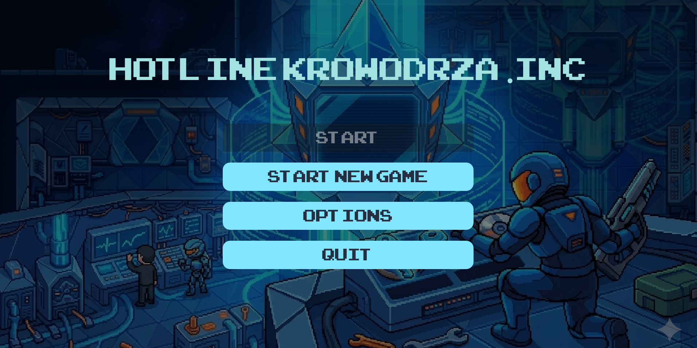
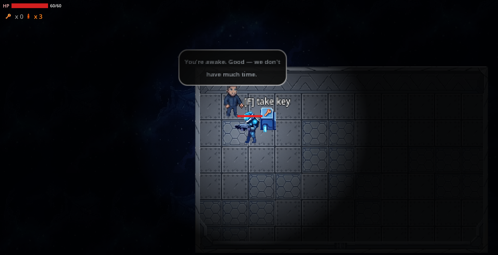
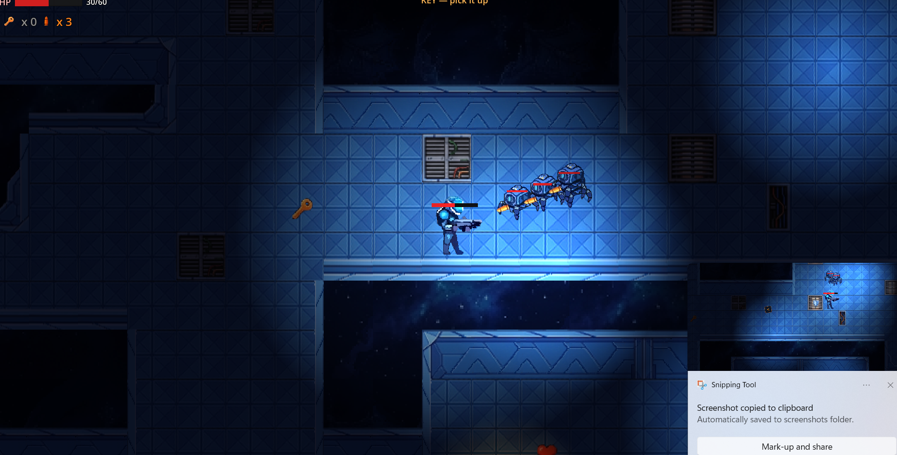

# HOTLINE KROWODRZA

**Autorzy:** Jakub Sadkiewicz, Aleksandra Fafara, Szymon Ciosek

---

## 1. Krótki opis gry

**HOTLINE KROWODRZA** to dwuwymiarowa gra akcji z widokiem z góry (top-down shooter), osadzona na pokładzie statku kosmicznego. Gracz wciela się w ostatniego ocalałego członka załogi, który musi przedrzeć się przez zabezpieczenia pokładu, pokonać zbuntowane jednostki ochrony i zatrzymać szalejący rdzeniowy system AI statku.

### Koncepcja

Gra łączy eksplorację zamkniętego labiryntu korytarzy z dynamiczną walką dystansową. Fabuła startuje w pokoju początkowym, gdzie NPC wyjaśnia sytuację: AI przeszła w tryb wrogi, załoga została zdziesiątkowana, a jedyną szansą na uratowanie statku jest dotarcie do rdzenia nawigacyjnego strzeżonego przez bossa - Cyclopsa. Gracz musi zdobyć klucz, otworzyć drzwi do głównego pokładu, przejść przez sekcje statku pełne wrogów i dotrzeć do sali bossa.

### Inspiracje

Bezpośrednie:
- **Hotline Miami** - szybka, bezpośrednia akcja, widok z góry, retro klimat i brutalna dynamika starć
- **The Binding of Isaac** / klasyczne dungeon crawl'e - eksploracja pokładu, zbieranie wzmocnień, progresja przez klucz i bossa
- **Enter the Gungeon** - strzelanie w kierunku kursora myszy, unikanie pocisków, granaty obszarowe

### Co wyróżnia tę wersję

- **Świat statku kosmicznego** zamiast miejskiego labiryntu - korytarze, migoczące światła, atmosfera pokładu
- **Wrogowie z „awarią"** - jednostki ochrony poruszają się z losowymi zacięciami, drganiami i błędami toru, co wizualnie uzasadnia fabułę zbuntowanej AI
- **Boss dwufazowy (Cyclops)** z telegraphiem ataku (linia ostrzegawcza przed szarżą)
- **Strefy zasadzki (ambush zones)** aktywujące ukrytych wrogów po wejściu gracza w obszar

---

## 2. Użyte narzędzia

| Element | Technologia |
|---------|-------------|
| Silnik | **Godot Engine 4.6** |
| Język skryptowy | **GDScript** |
| Platforma docelowa | **Windows** (PC) |
| Rozdzielczość okna | 2000 × 1000 px |

Gra uruchamiana jest na komputerze PC z systemem Windows. Projekt można otworzyć w edytorze Godot 4.6 lub wyeksportować jako samodzielny plik wykonywalny (`.exe`).

---

## 3. Mechaniki gry

### Świat gry

- **Widok:** 2D, top-down
- **Zasięg:** ograniczony - pokład statku zbudowany z kafelków (`TileMapLayer`), podzielony na sceny:
  - `game_starting_room` - pokój startowy z NPC, kluczem i drzwiami
  - `game` - główny pokład statku (dungeon)
  - `boss_room` - arena bossa
- Tło: animowane gwiazdy + warstwy kafelków podłogi i ścian
- Oświetlenie: dynamiczne `PointLight2D` z migotaniem w wybranych miejscach (`ship_ambience`)

### Kamera

- Kamera (`Camera2D`) jest przypisana do gracza
- Wygładzanie pozycji (`position_smoothing`) - kamera podąża za graczem płynnie
- Efekty walki: shake kamery i błysk ekranu przy trafieniach (`CombatFeel`)

### Postać gracza

| Atrybut | Wartość / opis |
|---------|----------------|
| Początkowe HP | 60 (maks. 60) |
| Prędkość | 85 px/s |
| Broń | strzał w kierunku kursora myszy (LPM / Spacja) |
| Granaty | 3 szt., cooldown 2,6 s, zasięg wybuchu ~52 px, obrażenia 3 |
| Tarcza | jednorazowa - blokuje pierwsze trafienie po podniesieniu |
| Klucze | wymagane do otwierania drzwi i bram |

Sterowanie:
- **WASD** - ruch
- **LPM / Spacja** - strzał (kierunek: mysz)
- **G** - granat
- **F** - interakcja (dialogi, klucz, drzwi, tablice)
- **ESC** - pauza

### NPC i dialogi

- W pokoju startowym znajduje się **NPC**, który po podejściu gracza uruchamia wieloliniowy dialog o zbuntowanej AI i misji ratunku
- Dialogi obsługiwane są przez dymki z przyciskiem **[F] Next**
- Tablice lore (`lore_sign`) w dungeonie dostarczają dodatkowego kontekstu świata

### System walki

**Gracz:**
- Pociski (`bullet.tscn`) - natychmiastowy strzał w kierunku celownika
- Granaty - rzut z opóźnionym wybuchem, obrażenia obszarowe na wrogów
- Tarcza pochłania jedno trafienie bez utraty HP

**Wrogowie - Spider (pająk):**
- HP: 5
- Maszyna stanów: **PATROL → CHASE → ATTACK**
- Strzelają do gracza z dystansu (zasięg ~220 px)
- W trybie ataku wykonują szarżę z wind-up, lungą i odrzutem
- „Awaria" - losowe zacięcia ruchu, zmiany prędkości i rotacji sprite'a

**Wrogowie - Cyclops:**
- HP: 5 (zwykły) / boss: rozszerzona wersja z fazami
- Większe obrażenia w zwarciu (2 pkt)
- Boss Cyclops: **faza II** po spadku HP poniżej 50% - szybsze ataki, większy zasięg wykrywania, telegraph linii przed szarżą

**Pathfinding wrogów:**
- Wrogowie korzystają z `AStarGrid2D` (`map_pathfinding.gd`) do nawigacji po pokładzie statku
- Siatka budowana dynamicznie wokół pozycji gracza i celu

**Spawning:**
- `EnemySpawner` - 24 pająki + 3 cyclopsy rozmieszczone w predefiniowanych punktach
- Wrogowie aktywują się, gdy gracz zbliży się na określoną odległość
- Strefy zasadzki (`ambush_zone`) uwalniają ukrytych wrogów po wejściu gracza

### Zadania i progresja

Gra nie posiada klasycznego quest loga - progresja jest liniowa z elementami eksploracji:

1. Rozmowa z NPC w pokoju startowym
2. Podniesienie klucza z platformy (**[F] take key**)
3. Otwarcie drzwi do głównego pokładu (**[F] open**)
4. Znalezienie klucza w dungeonie (wskazówka: strzałka celu na krawędzi ekranu)
5. Opcjonalnie: zebranie serc (+15 HP) i tarcz
6. Opcjonalnie: otwarcie bramy wschodniej (`key_gate`) drugim kluczem
7. Wejście do boss roomu i pokonanie Cyclopsa
8. Ekran końcowy z napisami

### Sugestie taktyczne

- **Zachowuj dystans** - pająki strzelają i szarżują; cyclopsy zadają więcej obrażeń w zwarciu
- **Używaj granatów** w zasadzkach i przy grupach wrogów
- **Zbieraj tarcze** przed trudniejszymi sekcjami - jednorazowa ochrona może uratować życie
- **Obserwuj telegraph bossa** - czerwona linia sygnalizuje nadchodzącą szarżę w fazie II
- Przy drzwiach bez klucza gra informuje: *„You need the key"*

### Interfejs użytkownika (HUD)

- Pasek zdrowia gracza (HP / max)
- Licznik kluczy, granatów, ikona tarczy
- Strzałka celu na krawędzi ekranu + tekst (*FIND KEY* / *BOSS ROOM*)
- Panel tutorialowy po wejściu do dungeonu (sterowanie)
- Pasek HP bossa i etykieta fazy w boss roomie
- Menu pauzy, ekran śmierci, menu główne z opcjami audio

### System zapisu

- Zapis w `user://savegame.json`
- Autosave co 10 sekund oraz przy ważnych zdarzeniach (śmierć wroga, pickup, zmiana sceny)
- Zapisywany stan: pozycja i statystyki gracza, żywotność wrogów, zebrane przedmioty, flagi (boss door, east gate)
- Menu główne oferuje **Continue** (kontynuacja) i **New Game** (nowa gra)

---

## 4. Użyte assety

### Grafika

| Asset | Pochodzenie | Uwagi |
|-------|-------------|-------|
| Postać gracza (`assets/pc/`) | Wygenerowany przez AI, przetworzony ręcznie | Animacje idle/chód w 4 kierunkach |
| Wrogowie - Spider (`assets/enemy_1/`) | Importowane / przygotowane ręcznie | Animacje sprite'ów |
| Wrogowie - Cyclops (`assets/enemy_2/`) | Importowane / przygotowane ręcznie | 3 klatki animacji |
| NPC (`assets/npc/`) | Importowane | 3 warianty postaci |
| Kafelki pokładu (`assets/bg/assets.png`, `assets-gray.png`) | Importowane, modyfikowane | Tileset statku; część kafelków przycinana skryptem `prune_tileset_atlas.py` |
| Tło gwiazd (`background_star.png`) | Importowane | Tło scen |
| Tło menu (`main_menu_bg.png`) | Importowane | Ekran tytułowy i zakończenia |
| Platforma klucza (`key_platform_*.png`) | Przygotowane ręcznie / edytowane | Wariant z kluczem i bez |
| Ikony (klucz, serce, tarcza, zamek, pocisk) | Importowane / przygotowane ręcznie | UI i obiekty interaktywne |
| Tekstura światła (`2d_lights_and_shadows_neutral_point_light.png`) | Importowana | Pakiet oświetlenia 2D (popularny asset Godot) |
| Czcionka (`ARCADECLASSIC.TTF`) | Importowana | Font retro/arcade do menu i UI |

### Audio

| Asset | Pochodzenie | Uwagi |
|-------|-------------|-------|
| Muzyka (menu, dungeon, boss, ending) | **Wygenerowana proceduralnie** | Skrypt `tools/generate_audio.py` - synteza fal sinusoidalnych i szumu |
| Efekty dźwiękowe (strzał, trafienie, śmierć, drzwi, pickup, tarcza, boss roar) | **Wygenerowane proceduralnie** | Ten sam skrypt Python |

--

## 5. Wykorzystanie AI

| Obszar | Sposób wykorzystania | Narzędzia |
|--------|---------------------|-----------|
| **Grafika postaci gracza** | Generacja sprite'a żołnierza sci-fi w pixel arcie, konwersja GIF → arkusz klatek | Narzędzie generatywne AI (grafika), ezgif.com (konwersja) |
| **Dialogi / fabuła** | Teksty NPC i lore - przygotowane z pomocą AI asystenta kodowania | Cursor AI (asystent) |
| **Audio** | Proceduralna synteza - **nie** generatywne AI | Python (`generate_audio.py`) |

AI **nie** było używane do: generacji całego świata i kodu, muzyki (poza proceduralną syntezą), pełnej grafiki tilesetu ani modeli uczących się zachowania postaci.

---

## 6. Uruchomienie gry

### Wymagania

- **Godot Engine 4.6** (lub nowszy 4.x zgodny z projektem)
- System **Windows 10/11**
- Karta graficzna obsługująca DirectX 12 (domyślny driver w projekcie: `d3d12`)

### Uruchomienie z edytora Godot

1. Pobierz i zainstaluj [Godot 4.6](https://godotengine.org/download)
2. Sklonuj repozytorium lub rozpakuj archiwum projektu
3. W Godot: **Import** → wskaż folder z plikiem `project.godot`
4. Otwórz projekt i naciśnij **F5** (lub przycisk Play)

Scena startowa: `res://scenes/starting_menu.tscn`

### Generowanie assetów audio (opcjonalne)

Jeśli pliki WAV nie istnieją w `assets/audio/`:

```bash
python tools/generate_audio.py
```

### Eksport jako plik wykonywalny

1. W Godot: **Project → Export**
2. Dodaj preset **Windows Desktop**
3. Ustaw ścieżkę eksportu (np. `build/HotlineKrowodrza.exe`)
4. Kliknij **Export Project**

> **Uwaga:** W repozytorium nie dołączono gotowego pliku `.exe`. Aby spełnić wymaganie modułu wykonywalnego, należy wyeksportować grę z Godot i dołączyć folder `build/` do oddania.

---

## 7. Zrzuty ekranu

| Plik | Opis |
|------|------|
|  | Menu główne |
|  | Pokój startowy z NPC i dialogiem |
|  | Walka na pokładzie statku |
|  | Walka z bossem Cyclopsem |

---

## 8. Bibliografia

- [Godot Engine 4 - dokumentacja](https://docs.godotengine.org/en/stable/) - silnik, `AStarGrid2D`, `TileMapLayer`, `CharacterBody2D`
- [Godot - AStarGrid2D](https://docs.godotengine.org/en/stable/classes/class_astargrid2d.html) - pathfinding wrogów po siatce kafelków
- [ARCADECLASSIC.TTF](https://www.dafont.com/) - czcionka retro (font arcade)
- Inspiracja gameplay: *Hotline Miami* (Dennaton Games, 2012)
- Pakiet oświetlenia 2D: tekstura `2d_lights_and_shadows_neutral_point_light` - popularny darmowy asset w społeczności Godot

---

## Struktura projektu (skrót)

```
HotlineKrowodrza/
├── assets/          # grafika, audio, czcionki
├── scenes/          # sceny Godot (.tscn)
├── scripts/         # logika gry (.gd)
├── tools/           # skrypty Python (audio, kafelki, edycja tilesetów)
├── docs/screenshots/ # zrzuty ekranu (do uzupełnienia)
└── project.godot    # konfiguracja projektu
```
